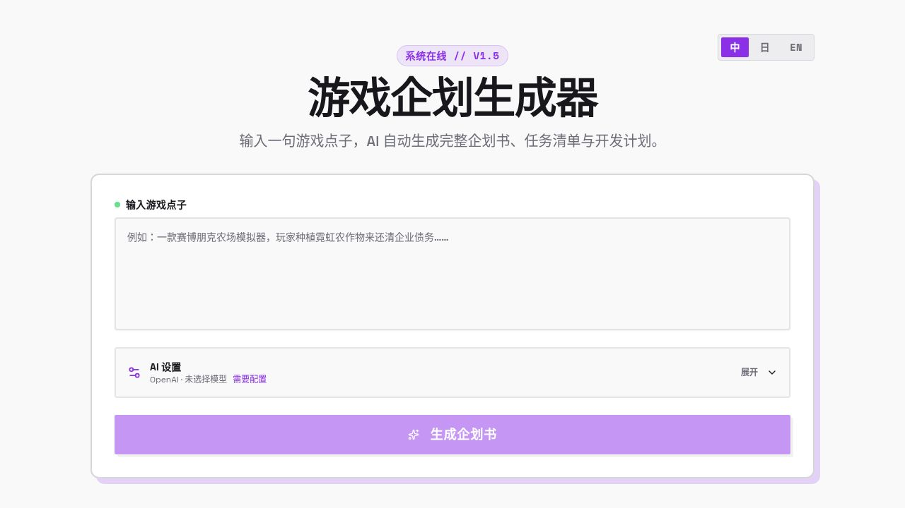


# 游戏企划生成器 / Game Plan Generator / ゲーム企画ジェネレーター

> **中文**：输入一句游戏点子，AI
> 自动生成游戏企划书、任务清单、技术难点与 7 天开发计划。\
> **English:** Turn a game idea into a design doc, task list, technical
> notes, and a 7-day development plan.\
> **日本語**：ゲームのアイデアから、企画書・タスク・技術課題・7日間の開発計画を自動生成します。

## 🚀 快速开始 / Quick Start / クイックスタート

**环境 / Requirements / 必要環境**

``` text
Node.js 18+
pnpm 8+
An API key from a supported AI provider
```

### 1. 安装 / Install / インストール

``` bash
git clone https://github.com/Anzellia/game-plan-generator.git
cd game-plan-generator
pnpm install
```

### 2. 启动 / Run / 起動

``` bash
pnpm run dev
```

打开 **http://localhost:5173**

**AI 配置 / AI Setup / AI 設定**

-   **中文：** 展开「AI 设置」，选择厂商、输入 API
    Key，并选择或手动填写模型 ID。可用「测试连接」验证模型。
-   **English:** Expand **AI Settings**, choose a provider, enter your
    API key, and select or enter a model ID. Use **Test Connection** to
    verify access.
-   **日本語：** **AI 設定**を開き、プロバイダー・API キー・モデル ID
    を設定してください。**接続テスト**で利用可否を確認できます。

> API Key 按厂商保存在当前浏览器的 `localStorage`
> 中。请求时会经由应用服务端转发至所选厂商，但不会持久化在服务端或仓库中。共享设备请勿保存密钥。\
> Keys are stored per provider in this browser's `localStorage` and are
> not persisted on the server or repository.\
> API キーはブラウザの `localStorage`
> にプロバイダー別で保存され、サーバーやリポジトリには保存されません。

------------------------------------------------------------------------

## ✨ 功能 / Features / 機能

| 中文 | English | 日本語 |
|---|---|---|
| AI 游戏企划书生成 | AI game design doc generation | AI ゲーム企画書生成 |
| 优先级 + 工时任务清单 | Prioritized task list with estimates | 優先度・工数付きタスク |
| 技术难点与解决方案 | Technical challenges & solutions | 技術課題と解決策 |
| 7 天开发计划 | 7-day development plan | 7日間の開発計画 |
| 中 / 日 / 英界面与输出 | ZH / JA / EN UI & output | 中・日・英 UI / 出力 |
| Markdown / PNG 导出 | Markdown / PNG export | Markdown / PNG エクスポート |
| 动态模型列表 + 自定义模型 ID | Dynamic model list + custom IDs | モデル一覧取得 + ID 手入力 |
| 多厂商独立保存配置 | Per-provider settings | プロバイダー別設定保存 |

## 🖥️ 界面演示 / UI Demo / 画面デモ



基本流程：

1.  输入游戏点子 / Enter an idea / アイデアを入力
2.  配置 AI / Configure AI / AI を設定
3.  生成企画书 / Generate / 企画書を生成

------------------------------------------------------------------------

## 📄 输出示例 / Example Output / 出力例

<details>
<summary>展开「光轨修复师」输出示例 / View example / 出力例を表示</summary>


提示词：我想做一个用于游戏竞赛的桌面益智解谜游戏。



</details>

------------------------------------------------------------------------

## 🛠 技术栈 / Tech Stack / 技術スタック

-   **Frontend:** React + Vite + TypeScript + Tailwind CSS + shadcn/ui
-   **Backend:** Express + TypeScript
-   **AI:** OpenAI / Anthropic / Google / xAI / DeepSeek
-   **Package Manager:** pnpm
-   **Export:** html-to-image / Markdown

## 📁 项目结构 / Project Structure / プロジェクト構成

``` text
├── client/       # React frontend
├── server/       # Express API server
└── package.json
```

## 📄 License

MIT
